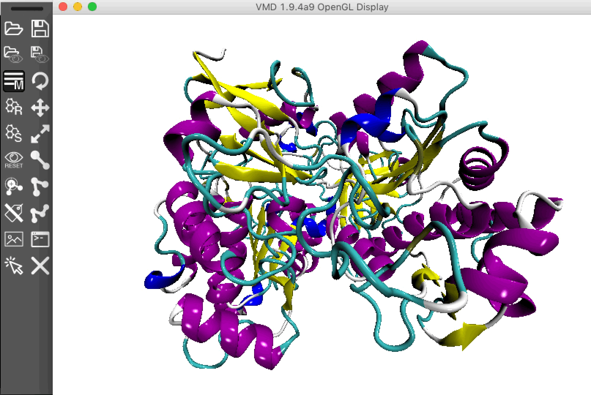
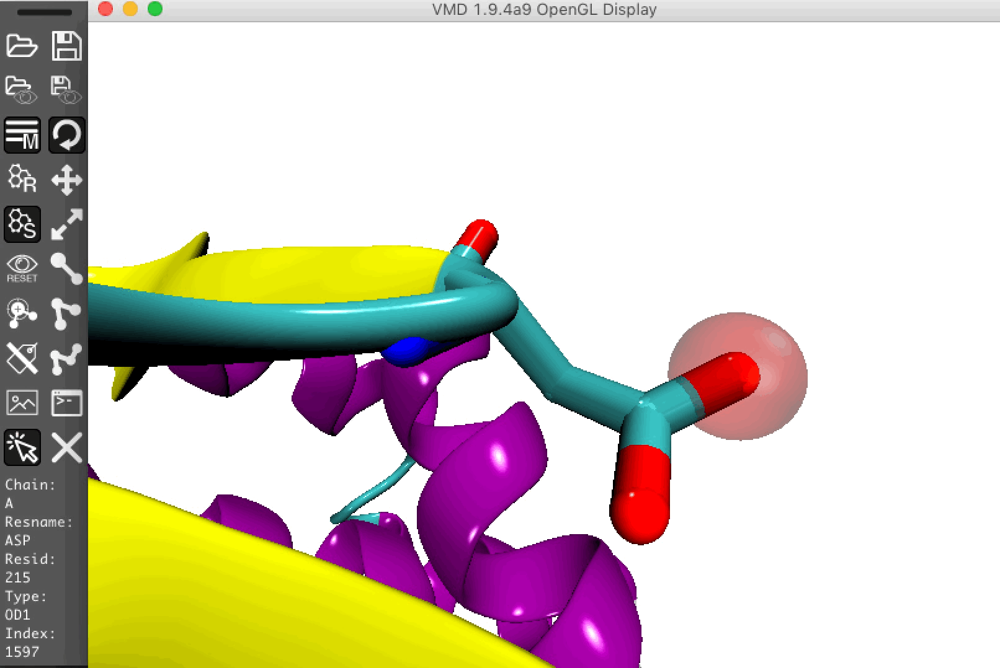

# Introduction
This toolbar allows you to reach easily and faster to all common used command avaialble on VMD.
Moreover, this plugin provide an easy to use interface to render beautiful images.

## Minimum Requirements

Operating System: macOS, Linux or Windows
Visual Molecular Dynamics (VMD) 1.9.3 or later

## Installation

You could install molUP through [vmdStore](https://github.com/portobiocomp/vmdStore) (Recommended).

## Contacts
If you have any suggestion of new features, please contact us: nscerque@fc.up.pt

## Citation
Not Available

## DOI
https://github.com/portobiocomp/toolBar